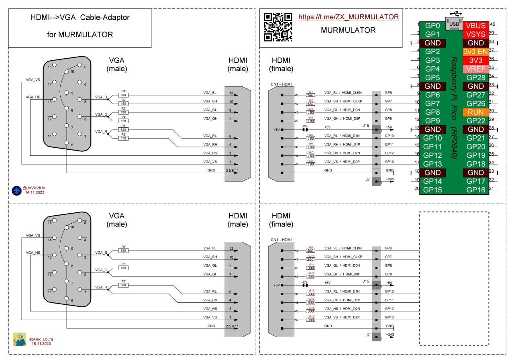

# murmulator-os
Murmulator OS v.0.2.6.1 

# Hardware needed
Raspberry Pi Pico (RP2040) 
Sources are "in-progress" state and testing now only on Murmulator devboard with VGA/HDMI/TV(RGB) output. 
Simplest Murmulator schema is availabele there: https://github.com/AlexEkb4ever/MURMULATOR_classical_scheme 

# This Archive
Extract MOS folder to your SD-Card to /MOS folder.

# Optional
There are several extra features supported, like external PSRAM and/or DAC, are availbel on more featured Murmulator versions. 
Let use translate from russian on https://murmulator.ru/types site, for case you want to get more info.

# Current state
RP2040 core 0: starts FreeRTOS (based on https://github.com/FreeRTOS/FreeRTOS-Community-Supported-Demos/tree/3d475bddf7ac8af425da67cdaa2485e90a57a881/CORTEX_M0%2B_RP2040)  
RP2040 core 1: starts VGA/HDMI/TV(RGB) driver (based on Murmulator comunity version last used before in https://github.com/xrip/pico-launcher)

# MOS build hints:
 - use SDK 1.5.1 https://github.com/raspberrypi/pico-setup-windows/releases 
 - update TinyUSB in your SDK ("C:\Program Files\Raspberry Pi\Pico SDK v1.5.1\pico-sdk\lib\tinyusb") to version: cfbdc44a8d099240ad5ef208bd639487c2f28153    branch 'master' of https://github.com/hathach/tinyusb 
 - update exit_from_boot2.S (patch/exit_from_boot2.S there) in SDK ("C:\Program Files\Raspberry Pi\Pico SDK v1.5.1\pico-sdk\src\rp2_common\boot_stage2\asminclude\boot2_helpers\exit_from_boot2.S") 
 - cmake command (for CLI-build Win10/11): "C:\Program Files\Raspberry Pi\Pico SDK v1.5.1\cmake\bin\cmake.EXE" -DCMAKE_BUILD_TYPE:STRING=MinSizeRel -DCMAKE_EXPORT_COMPILE_COMMANDS:BOOL=TRUE "-DCMAKE_C_COMPILER:FILEPATH=C:\Program Files\Raspberry Pi\Pico SDK v1.5.1\gcc-arm-none-eabi\bin\arm-none-eabi-gcc.exe" "-DCMAKE_CXX_COMPILER:FILEPATH=C:\Program Files\Raspberry Pi\Pico SDK v1.5.1\gcc-arm-none-eabi\bin\arm-none-eabi-g++.exe" --no-warn-unused-cli -SC:/Pico/murmulator/Cross/murmulator-os -Bc:/Pico/murmulator/Cross/murmulator-os/build -G Ninja 
 - Linux: cmake -DCMAKE_BUILD_TYPE:STRING=MinSizeRel -DCMAKE_EXPORT_COMPILE_COMMANDS:BOOL=TRUE "-DCMAKE_C_COMPILER:FILEPATH=/usr/b
in/arm-none-eabi-gcc" "-DCMAKE_CXX_COMPILER:FILEPATH=/usr/bin/arm-none-eabi-g++" --no-warn-unused-cli ... (see linux.build-alt.sh) 
 - Linux: create symlinks: 
  - /path/to/tinyusb-0.16.0/hw/bsp -> /path/to/murmulator-os/include/bsp 
  - /path/to/tinyusb-0.16.0/hw/mcu -> /path/to/murmulator-os/include/mcu 
 - for GUI VSCode build mode do not miss to set build Configuration to use "GCC 10.3.1. arm-none-eabi" and "MinSizeRel" 

# MOS applications build hints:
 - use SDK 1.5.1 https://github.com/raspberrypi/pico-setup-windows/releases 
 - ignore linker (ld) errors 
 - for GUI VSCode build mode do not miss to set build Configuration to use "GCC 10.3.1. arm-none-eabi" and "Release" (or "MinSizeRel") 
 - lookup for appropriated "obj" file, rename it and use as executable 

# OS syscalls
TBA

# Murmulator OS tips
Murmulator OS (M-OS to make it short) has no specific levels of execution like kernel and application. All code parts (kernel/application) executes on the same level (like it was in good old DOS). 
 
M-OS uses a mono-kernel architecture, it means we have no separate kernel modules, all kernel related code is precompiled, prelinked and preinstalled on hardware. Only application level code is replaceable while kernel is working. 
 
M-OS is based on FreeRTOS port for RP2040 (Base version: FreeRTOSv202212.01. Examples used: https://github.com/FreeRTOS/FreeRTOS-Community-Supported-Demos/tree/3d475bddf7ac8af425da67cdaa2485e90a57a881/CORTEX_M0%2B_RP2040) which is running on core#0 of the RP2040. No SPI support for now. System time slice (tick) used by FreeRTOS = 1ms. 
 
M-OS manages access to 
 - SRAM (256+4+4KB installed on RP2040), 
 - PSRAM (4-8MB installed on Murmulator board since v.1.3), 
 - FLASH ROM (2-16MB installed on Rasperry Pi Pico), 
 - SD-CARD (FAT32, connected to Murmulator board), 
 - VGA/HDMI/TV adapter (222-color schema, installed on Murmulator board), 
 - PS/2 keyboard (connected to Murmulator board), 
 - Kempston (Dendy 8-bit) Joystick (connected to Murmulator board), 
 - Sound devices (PWM 12-bit stereo + "speaker" or TDA1387T/PCM5102A DAC chip in "PCM" build versions) 
 
Other types of 
 - video outputs: TFT/ILI9341/...; 
 - inputs: USB HUD devices, PS/2 and other mouse types, Wii Joystick...; 
to be supported later. 
 
M-OS is installed as bootable application for RP2040 on Rasperry Pi Pico FLASH ROM. 
Addresses map (16MB flash): 
10000000..10001000h - .boot2       - contains 4k startup block 
10001000..10FE0000h - 4063 M-OS managed 4k pages, that may be provided to or shared with application level 
10FE0000..10FFF000h - .text        - contains 124k of M-OS core 
10FFF000..11000000h - .sys_table   - contains 4k table of pointers to functions, M-OS provides for application level  
(memmap.ld to be provided) 
 
M-OS application should try to reuse functions from OS instead of linking other libraries. 
M-OS application should not use malloc/calloc/free functions from standard library, but call specific wrappers provided in m-os-api.h (TBA - full list of functions) 
 
Example of application level wrapper definition (will be provided whole set of wrappers in the m-os-api.h header file): 

#define M_OS_API_SYA_TABLE_BASE (void*)0x10001000ul 
static const unsigned long * const _sys_table_ptrs = M_OS_API_SYA_TABLE_BASE; 
typedef void (*draw_text_ptr_t)(const char *string, uint32_t x, uint32_t y, uint8_t color, uint8_t bgcolor); 
#define _draw_text_ptr_idx 25 
#define draw_text ((draw_text_ptr_t)_sys_table_ptrs[_draw_text_ptr_idx]) 
 
So it will be possible to call draw_text the same way as for case graphics.h and VGA/HDMI/TV driver exists, but without it. 

# M-OS commands
cls - clear screen 
dir / ls [dir] - show directory content. Use Ctrl+C to interrupt. 
rm / del / era [file] - remove file (or empty directory) 
cd [dir] - change current directory 
cp [file1] [file2] - copy file1 as file2 
mkdir [dir] - create directory 
cat / type [file] - type file. Use Ctrl+C to interrupt. 
rmdir [dir] - remove directory (recurive) 
elfinfo [file] - provide .elf file info 
psram - provide some psram info. Use Ctrl+C to interrupt. 
swap - provide some swap info. Use Ctrl+C to interrupt. 
sram - reference speed of swap base SRAM. Use Ctrl+C to interrupt. 
cpu - show current CPU freq. and dividers, `cpu [NNN]` - change freq. to NNN MHz (it may hang on such action) 
mem - show current memory state 
set - show or set environment variables 
export - put variable into system context 
mode [#] - set video-mode, for now it is supported: 
<li>
 <ul>0 - 53x30, 1 - 80x30, 2 - 100x37, 3 - 128x48, 4 - 256x256x2-bit, 5 - 512x256x1-bit, 6 - 320x240x4-bit, 7 - 320x240x8-bit, 8 - 640x480x4-bit - for VGA</ul>
 <ul>0 - 53x30 and 1 - 80x30, 2 - 320x240x4-bit for HDMI</ul>
 <ul>0 - 53x30 for TV (RGB)</ul>
</li>
less - show not more than one page of other command in pipe, like `ls | less`. Use Ctrl+C for exit. 
hex [file]/[@addr] - show file or RAM as hexidecimal dump. Use Ctrl+C to interrupt. 
tail [-n #] [file] - show specified (or 10) last lines from the file. Use Ctrl+C to interrupt. 
usb [on/off] - start a process to mount murmulator CD-card as USB-drive (NESPAD [B] button in mc) 
mc - Murmulator Commander, use [CTRL]+[O] to show console, and [CTRL]+[Enter] for fast type current file path 
mcview [file] - Murmulator Commander Viewer 
mcedit [file] - Murmulator Commander Editor 
mv [from_file_name] [to_file_name] - move/rename the file 
gmode [#] - simple graphics mode test 
font [width] [height] - show/set font size for graphics modes, like `font 6 8` 
blimp [n1] [n2] - simple sound test. [n1] number of cycles, [n2] OS ticks between high and low levels (1/freq.) 
wav [file] - simple .wav files player (tested on 8 kHz 1-channel 16-bit files). Use Ctrl+C to interrupt. 
basic [file] - tiny basic interperator implementation (by Stefan Lenz, see https://github.com/slviajero/tinybasic for more info). Use Ctrl+C to interrupt. 
ps - list of "processes" (FreeRTOS tasks). 
kill [n] - send SIGKILL to a "process" (FreeRTOS task), [n] - task number returned by the `ps` utility. 
dhrystone [n] [kHz] - small performance test (see: https://github.com/DnCraptor/arm_benchmarks) 
whetstone [n] - MIPS (whetstone) performance test (see: https://github.com/DnCraptor/arm_benchmarks) 
 
[cmd] &gt; [file] - output redirection to file 
[ENTER] - start command / flash and run .uf2 file in "demo" format (NESPAD [A] button in mc) 
[TAB] - autocomplete 
[BACKSPACE] - remove last character 
[CTRL]+[SHIFT] - rus/lat 
[CTRL]+[ALT]+[DEL] - reset (NESPAD [SELECT]+[B]) 
[CTRL]+[TAB]+[+] - increase CPU freq. 
[CTRL]+[TAB]+[-] - decrease CPU freq. 
[ALT]+[0-9]+[0-9]+[0-9] - manual enter some character by its decimal code (CP-866 codepage) 

# M-OS system variables
BASE - base directory with commands implementations 
SWAP - swap settings 
COMSPEC - a path to command interpretator 
PATH - list of directories to lookup for applications 
GMODE - set initial graphics mode 
TEMP - specify a folder with temporary files 

# Boot-loader mode
If uf2 application was started from M-OS, and such application is not designed for M-OS, it is possible to return to M-OS only via reboot: 
Press [F11] or [SPACE] (DPAD [SELECT]) and hold on the Murmulator reset or power-on, in this case uf2 application startup will be skip and you will return to the M-OS. And in case DPAD [B] button is also hold, it automounts SD-Cart as USB-drive. 
Press [F12] or [ENTER] (DPAD [START]) and hold on the Murmulator reset or power-on, in case you want to start USB-drive mode prior starting M-OS. 
Press [TAB] (DPAD [A]) and hold on the Murmulator reset or power-on, in case you want to replace default output by seconday driver. 
Press DPAD [B] and hold on the Murmulator reset or power-on, in case you want to switch default output to third output. 
Press [HOME] and hold on the Murmulator reset or power-on, in case you want  start USB-drive mode prior starting M-OS. 
